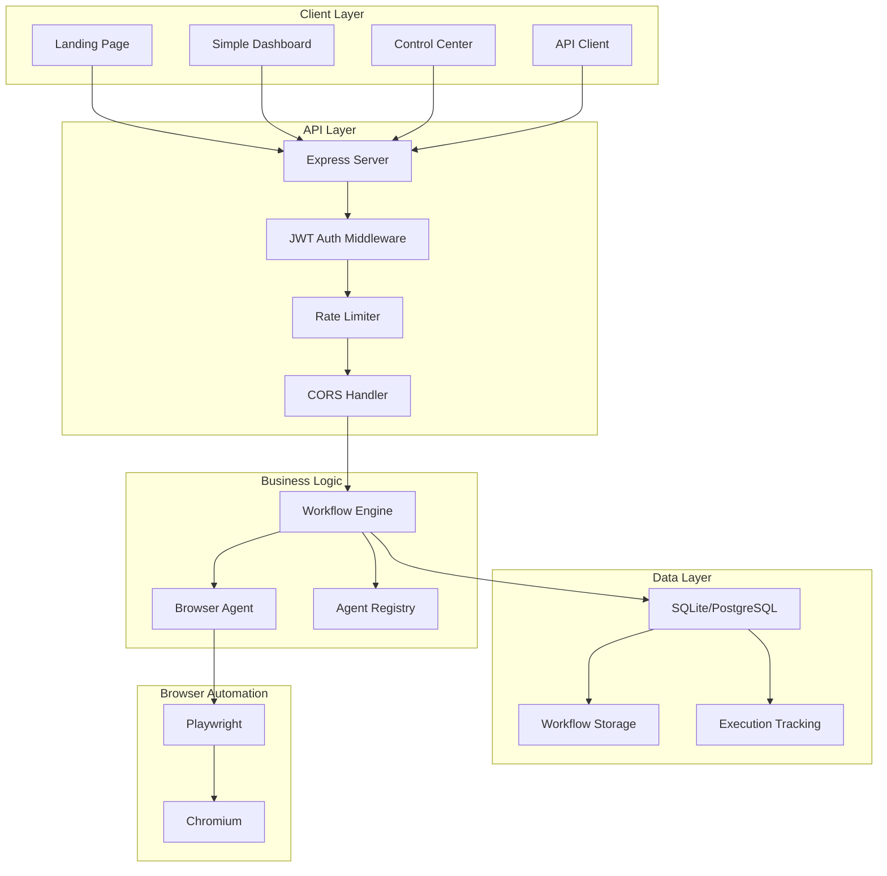
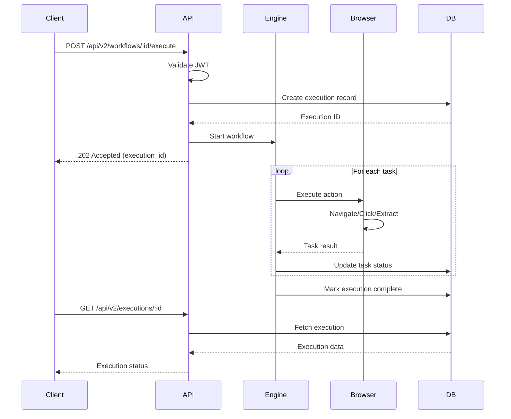
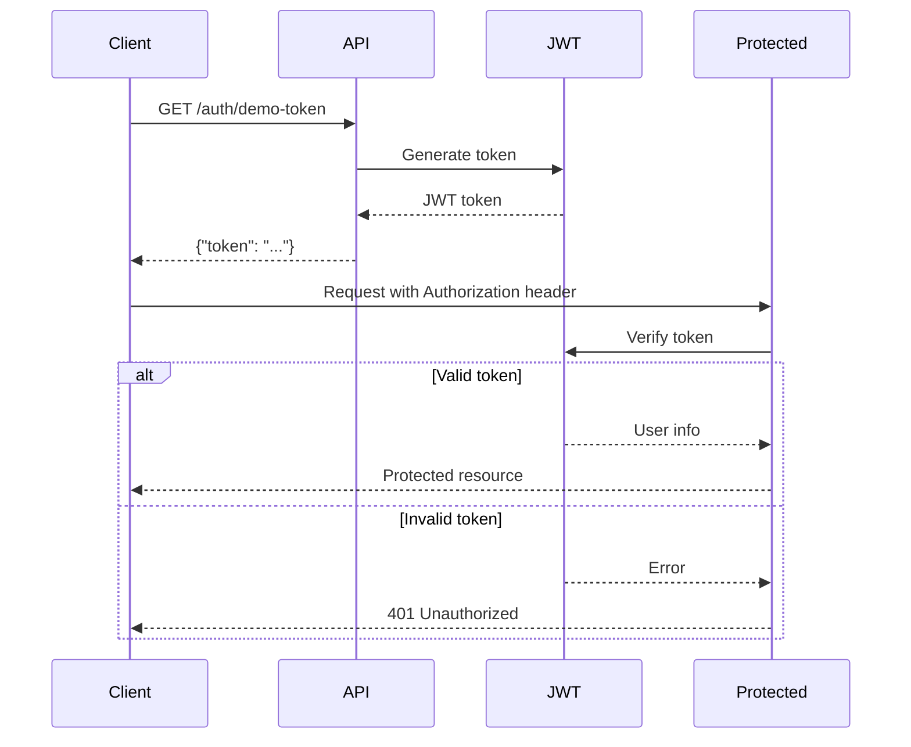
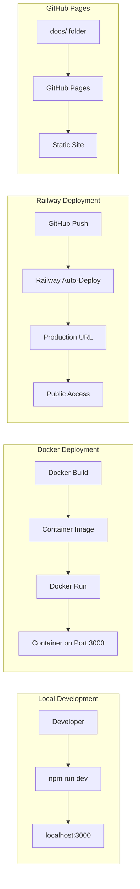
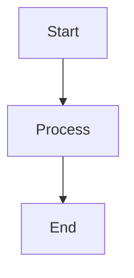

# Architecture Diagrams

This directory contains system architecture and flow diagrams for Workstation.

## 📊 Available Diagrams

### System Architecture (Mermaid)



### Workflow Execution Flow



### Authentication Flow



### Deployment Architecture



## 🎨 Creating Diagrams

### Using Mermaid (Recommended)

Mermaid diagrams can be embedded directly in Markdown:

````markdown

````

**Tools:**
- [Mermaid Live Editor](https://mermaid.live/)
- [Mermaid Documentation](https://mermaid-js.github.io/)
- GitHub/GitLab render Mermaid automatically

### Using Draw.io

1. Visit [draw.io](https://draw.io)
2. Create diagram
3. Export as SVG or PNG
4. Save to this directory

### Using Excalidraw

1. Visit [excalidraw.com](https://excalidraw.com)
2. Create hand-drawn style diagram
3. Export as PNG/SVG
4. Save to this directory

## 📝 Diagram Guidelines

### Style
- **Consistent colors**: Use project color scheme
- **Clear labels**: Short, descriptive text
- **Logical flow**: Left-to-right or top-to-bottom
- **Grouping**: Use subgraphs for related components

### Format
- **Preferred**: SVG (scalable, small file size)
- **Alternative**: PNG (if SVG not possible)
- **Avoid**: JPEG (poor quality for diagrams)

### Naming
- Lowercase with hyphens: `system-architecture.svg`
- Descriptive: `workflow-execution-flow.svg`
- Versioned if needed: `architecture-v2.svg`

## 📚 Diagram Ideas

### System Diagrams
- [ ] High-level system architecture
- [ ] Component interaction diagram
- [ ] Data flow diagram
- [ ] Technology stack visualization

### Process Flows
- [ ] User authentication flow
- [ ] Workflow creation process
- [ ] Browser automation sequence
- [ ] Error handling flow

### Deployment
- [ ] Deployment options comparison
- [ ] Network architecture
- [ ] Security boundaries
- [ ] Scaling strategy

### Developer Guides
- [ ] Development workflow
- [ ] Testing strategy
- [ ] CI/CD pipeline
- [ ] Contribution process

## 🔗 Using Diagrams

### In Markdown Documentation
```markdown

```

### In HTML Pages
```html

```

### With Captions
```markdown

*Figure 1: Workstation System Architecture*
```

## 🤝 Contributing Diagrams

Have a useful diagram? Add it!

1. Create diagram using preferred tool
2. Export as SVG (or PNG if necessary)
3. Add to this directory
4. Update this README
5. Reference in relevant documentation
6. Submit pull request

See [CONTRIBUTING.md](../guides/CONTRIBUTING.md) for details.

---

**Help us visualize the system! 📊**
